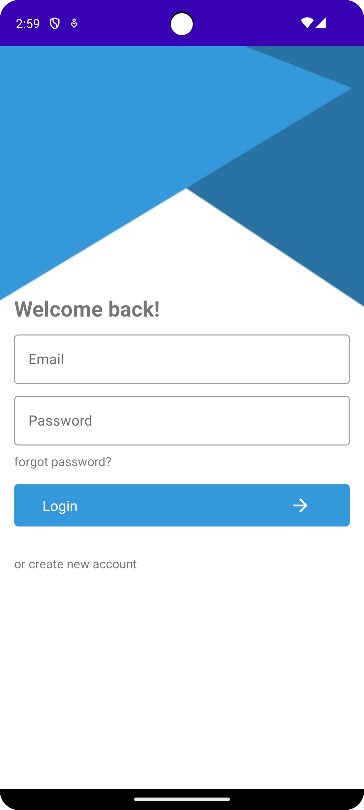
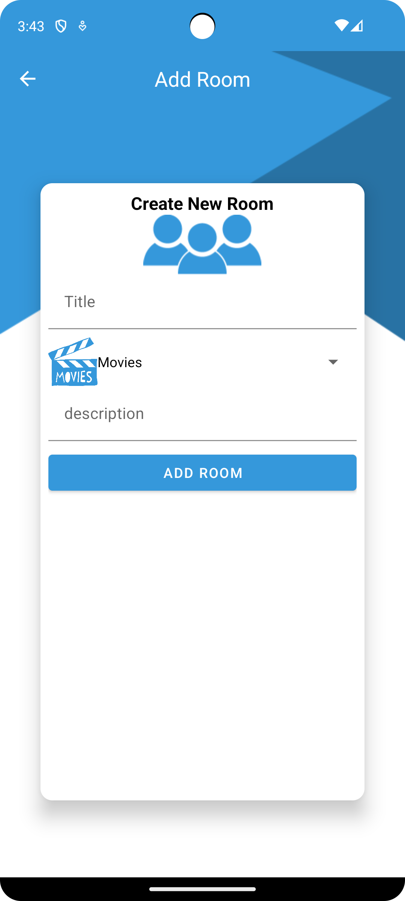
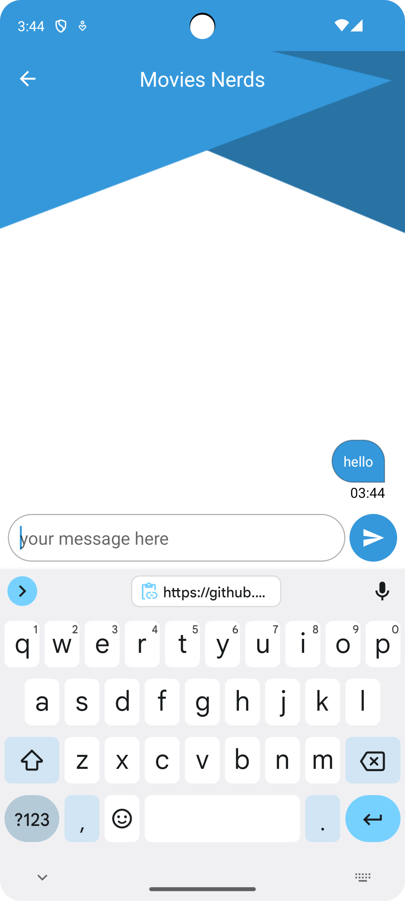
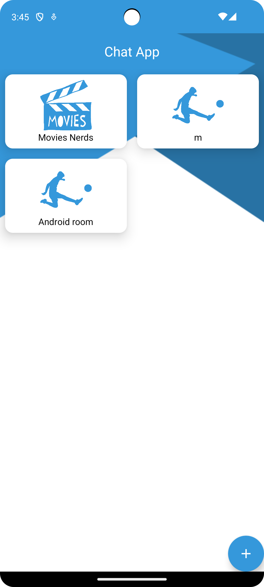

# Chat Application

## Overview

The Chat Application, built with Kotlin, is a versatile messaging platform that enables users to communicate in real-time through text messages, images, videos, and voice notes. With a sleek and user-friendly interface, the app offers a seamless chatting experience for individuals and groups.

## Features

- **Real-time Messaging:** Exchange text messages instantly with friends and contacts.
- **Multimedia Sharing:** Share images, videos, and voice notes within chats.
- **Group Chats:** Create and participate in group conversations with multiple users.
- **Emoji and Stickers:** Express emotions and reactions using a variety of emojis and stickers.
- **Push Notifications:** Receive notifications for new messages and updates even when the app is not active.
- **Search Functionality:** Easily search for messages, contacts, and media files within the app.
- **Security and Privacy:** Implement end-to-end encryption and privacy settings to protect user data.

## Technology Stack

- **Programming Language:** Kotlin
- **Backend Services:** Utilize cloud-based servers or Firebase for message storage and retrieval.
- **Database:** Implement a database system (e.g., Firebase Realtime Database or Room) for storing chat data locally.
- **Development Tools:** Android Studio for development, Firebase for authentication and cloud services.

## Future Enhancements

- Integration of additional features such as voice and video calling capabilities.
- Implementation of chatbots for automated responses and assistance.
- Enhancements to security features to ensure maximum privacy and data protection.
- Integration with social media platforms for seamless sharing and connectivity.

## Screenshots

| Screenshot 1 | Screenshot 2 | Screenshot 3 | Screenshot 4 |
|---------------|---------------|---------------|---------------|
|  |  |  |  |

## Installation

1. Clone the repository:

git clone https://github.com/zeyad1910/Chat.git

Copy code

2. Open the project in Android Studio.

3. Build and run the app on an Android device or emulator.

## Contributions

Contributions are welcome! Please feel free to submit issues or pull requests.
